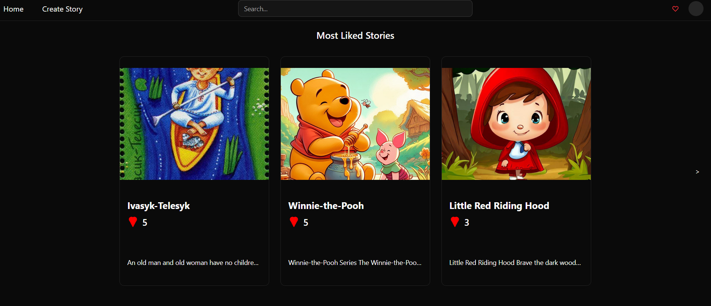
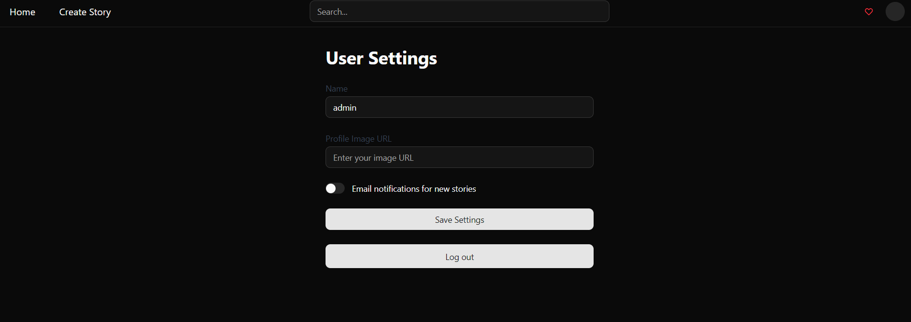
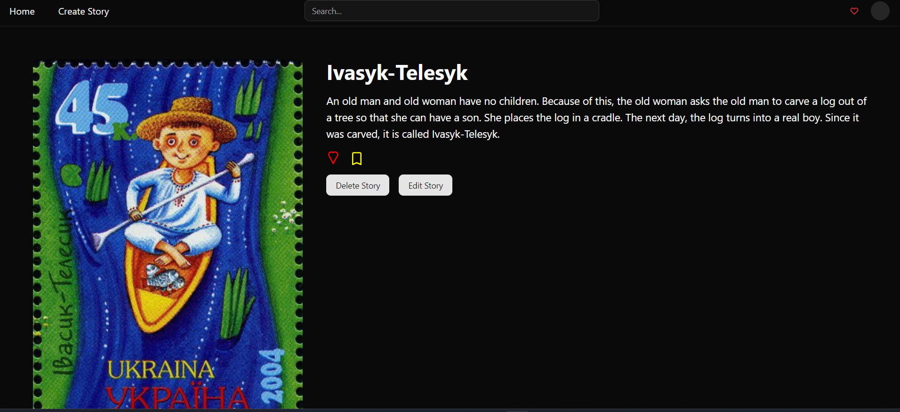

# Bedtime Stories Website

### Overview

This is the frontend part of the Bedtime Stories platform – a user-friendly interface for reading and managing bedtime stories.

➡️ Backend: [fairy-tales-backend](https://github.com/StudentPP1/fairy-tales-backend)

---

### Demo

Here’s a quick demo of how the project works:

#### 🏠 Home Page


#### 👤 User Profile


#### 📖 Story Page


---

### Tech Stack

- **React**
- **TypeScript**
- **shadcn/ui**

---

### Local Setup

1. **Clone the repository:**

```bash
git clone https://github.com/your-username/fairy-tales-frontend.git
cd fairy-tales-frontend
```

2. **Install dependencies:**
```bash
yarn install
```

3. **Configure environment variables:**

    Create a `.env.local` file in the root directory with the following content:
```env
VITE_API_BASE_URL=http://localhost:8081/api
VITE_FRONT_URL=http://localhost:5137
```

4. **Run the development server:**

```bash
yarn dev
```